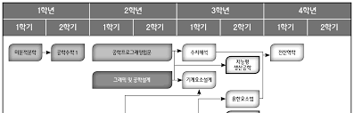
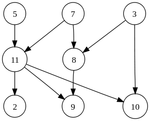
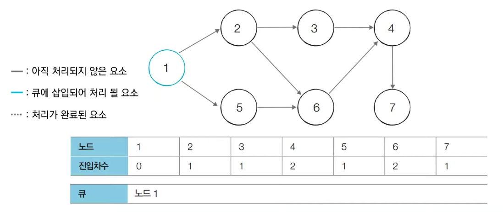
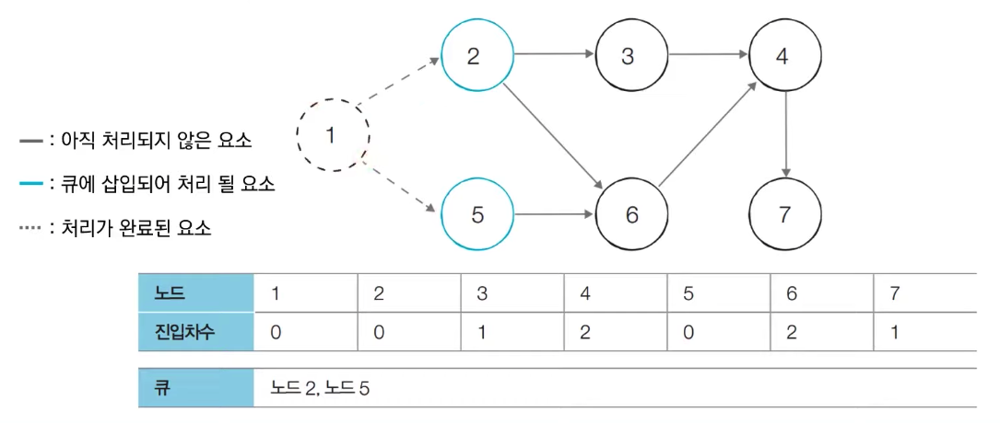

# 2주차 : 위상 정렬(Topological sorting)

# 위상 정렬 알고리즘

> 비순환 유향 그래프(DAG, Directed Acyclic Graph)에서 선후 관계에 따라 그래프를 정렬하는 알고리즘

### Directed Acyclic Graph

간선(edge)에 방향성이 존재하며, 임의의 정점(vertex)에서 출발했을 때 동일한 정점으로 돌아올 수 없는 그래프.

### 위상 정렬

DAG를 선후 관계에 따라 정렬하는 것이다. 

- 위상 정렬의 예시
    - 대학 선수과목
        
        
        
    - 위상 정렬된 그래프
        
        
        

### 위상 정렬을 수행하기 위한 방식

1. Kahn’s Algorithm(BFS)
    
    ```
    1. 자신을 가리키는 간선이 없는 정점을 찾는다.
    2. 정점을 출력하고 해당 정점과 정점에서 출발하는 모든 간선을 제거한다
    3. 정점이 남아 있다면, 반복한다.
    ```
    
    
    
    
    
    
    
    *source: [https://freedeveloper.tistory.com/278?category=888096](https://freedeveloper.tistory.com/278?category=888096)*
    
2. DFS
    
    ```
    dfs, visited 배열을 사용, 후위 순회
    간선을 순회하면 dfs 함수를 실행한다
    dfs 함수 구조
    1. 정점을 방문 배열에 기록한다, 방문 배열에 이미 기록되어 있다면 리턴한다.
    2. 해당 정점에서 출발하는 간선이 있다면 재귀 호출한다.
    3. 정점을 출력한다.
    ```
    

---

## 문제 풀어보기

줄 세우기 (Gold3) - [https://www.acmicpc.net/problem/2252](https://www.acmicpc.net/problem/2252)

```python
from collections import deque

# idx -> value 순으로 간선을 기록한 edges와 value -> idx 순으로 간선을 기록한 priorities 인접 리스트
N, M = map(int, input().split())
priorities = [[] for _ in range(N+1)]
# priorities = [0] * (N+1)
edges = [[] for _ in range(N+1)]
for _ in range(M):
    front, rear = map(int, input().split())
    edges[front].append(rear)
    priorities[rear].append(front)
    # priorities[rear] += 1

# 이번에 제거할 정점을 보관하는 queue 생성
queue = deque()
for node in range(1, N+1):
    if priorities[node]:
        continue
    queue.append(node)

# Kahn's algorithm
answer = []
while queue:
    now_node = queue.popleft()
    answer.append(now_node)
    for next_node in edges[now_node]:
        # priorities에서 이번 정점을 찾아서 제거
        index_of_now_node = priorities[next_node].index(now_node)
        priorities[next_node].pop(index_of_now_node)
        # priorities[next_node].pop()
        # priorities[next_node] -= 1
        # priorities[node]를 모두 출력 후, 즉 priorities[node] == []면 node 출력 가능
        if not priorities[next_node]:
            queue.append(next_node)

if len(answer) == N:
    print(*answer)
else:
    print("It is not DAU(Directed Acyclic Graph)")
```

시간복잡도(Kahn’s Algorithm)

`O(V + E) V: 정점의 개수, E: 간선의 개수` 

---

### 추가 문제

최종 순위 (Gold ?) - [https://www.acmicpc.net/problem/3665](https://www.acmicpc.net/problem/3665)

- 코드
    
    ```python
    TESTCASE = int(input())
    for tc in range(TESTCASE):
        n = int(input())
        last_ranking = list(map(int, input().split()))
        edges = [[False] * (n+1) for _ in range(n+1)]
        # 검색 및 삭제에 많은 시간 소요, 따라서 인접 행렬로 변경
        # for idx in range(n-1):
        #     for rear_idx in range(idx+1, n):
        #         edges[idx].append(rear_idx)
        #         priorities[rear_idx].append(idx)
        #
        # m = int(input())
        # for _ in range(m):
        #     change_a, change_b = map(int, input().split())
        #     if change_a in edges[change_b]:
    
        # 인접 행렬
        for idx in range(n-1):
            for rear_idx in range(idx+1, n):
                now = last_ranking[idx]
                rear = last_ranking[rear_idx]
                edges[now][rear] = True
    
        # 순서 변경
        m = int(input())
        for _ in range(m):
            a, b = map(int, input().split())
            edges[a][b], edges[b][a] = edges[b][a], edges[a][b]
    
        # --- 입력부 종료
        # priority가 없는지(앞에 설 사람의 수가 0인지) 빠르게 체크하기 위한 priorities list 생성 및 초기 queue 생성
        priorities = [0] * (n+1)
        nexts = []
        for col in range(1, n+1):
            cnt = 0
            for row in range(1, n+1):
                if edges[row][col]:
                    cnt += 1
            priorities[col] = cnt
            if cnt == 0:
                nexts.append(col)
        # 1번이 두 명 이상인 경우
        if len(nexts) >= 2:
            print('?')
            continue
        
        # Kahn Algorithm
        answer = []
        while len(nexts) == 1:
            now = nexts.pop()
            answer.append(now)
            for col in range(1, n+1):
                if edges[now][col] is False:
                    continue
                edges[now][col] = False
                priorities[col] -= 1
                if priorities[col] == 0:
                    nexts.append(col)
        
        # ?에 해당하는 경우가 존재할 수 없는가? 일단, 테케에는 존재하지 않는다.
        if len(nexts) >= 2:
            print('?')
        elif len(answer) != n:
            print("IMPOSSIBLE")
        else:
            print(*answer)
    ```
    

---

참고

- [https://ko.wikipedia.org/wiki/위상정렬](https://ko.wikipedia.org/wiki/%EC%9C%84%EC%83%81%EC%A0%95%EB%A0%AC)
- [https://velog.io/@kimdukbae/위상-정렬-Topological-Sorting](https://velog.io/@kimdukbae/%EC%9C%84%EC%83%81-%EC%A0%95%EB%A0%AC-Topological-Sorting)
- [https://freedeveloper.tistory.com/278?category=888096](https://freedeveloper.tistory.com/278?category=888096)
